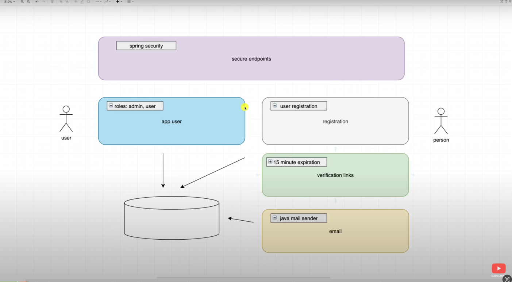
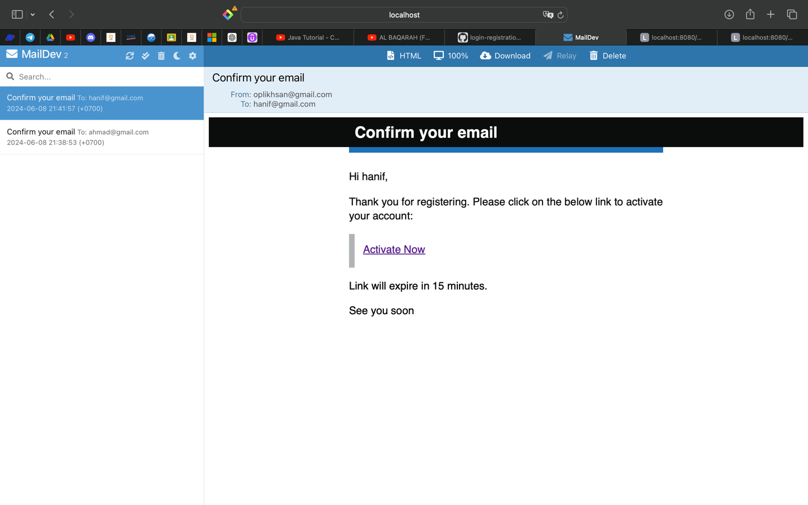
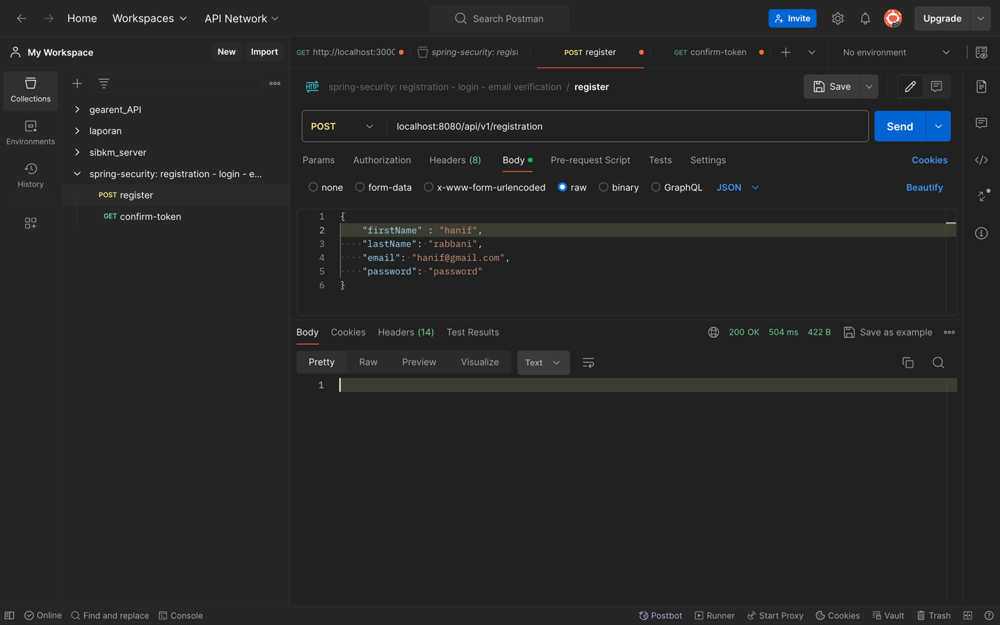

# user authentication
tutorial dari amigoscode: https://www.youtube.com/watch?v=QwQuro7ekvc&t=4881s

Proyek membuat user authentication berupa:
 -  Registration
 -  Login
 - Verifikasi akun lewat email

# Langkah - langkah

## user app
1. Buat entity user : @Entity
2. Buat implementasi UserDetails: @AllArgsConstructor
3. Buat repository untuk ambil email user :@Repository
4. Buat implementasi UserDetailsService : @Service
    - Pake poin no 3 untuk loadByUsername
    - hasildari loadByusername user
    - lalu return new AppUserDetail di no 2, masukin parameter user kedalamnya

## registration
1. Buat user controller untuk registrasi
   - Kasih parameter userrequest
   - balikan berupa registration service 

## security
1. Buat fungsi return SecurityFilterChain dengan parameter httpSecurity
    - atur csrf dan request user

## registration service
1. buat email validator 'regex'
2. didalam appuseerservice(userDetailsService) kita buat fungsi baru untuk menangani register user  
  - yaitu signUp(User user)
  - cek apakah email sudah digunakan oleh user lain
  - jika ya throw exception
  - encode password user menggunakan BCryptPasswordEncoder (dependency injection)
  - set user.password dengan hasil encode
  - save user 
3. didalam registartion service panggil singUp dan isi parameternya dari input user

## Email Confirmation
1. buat package baru didalam registration > token 

registration > token >

ConfirmationToken sebagai entity
ConfirmationTokenReposiroty - mencari token berdasarkan token
ConfirmationTokenService memanggil repository untuk
- get token
- save entitiy Confirmation token
- set confirmedAt, kapan token itu dipakai

2. kita lanjutakan ke appUserService(USerDetailService)
untuk implementasi signUp. setelah kita menyimpan data user saatnya kita generate token dan masukan ke dalam database
- kita buat confirmation token
- panggil confirmation token service dan simpan confirmation token ke database

3. confirm token 
- setalah berhasil membuat token dan menyimpannya kita akan konfirmasi token yang sudah disimpan
- kita akan buat fungi tambahan di registration service untuk confirmToken(token)
- kita akan melakukan validasi berupa
-- cek token apa ada
-- cek tokennya sudah pernah di confirm apa belum
-- cek sudah expired apa belum 
- setelah validasi selesai kita panggil ConfirmationTokenService untuk menset confirmedAt nya
- appUserService kita buat fungsi untuk enable status user jadi true agar bisa login 

4. send email
- kirim email lewat java mail sender
- menggunakan mail dev untuk smtp
- user mmasuk ke email dan klik link verified dan itu mengarah ke confirm email

# Email verification link with expiry

# Example Request
